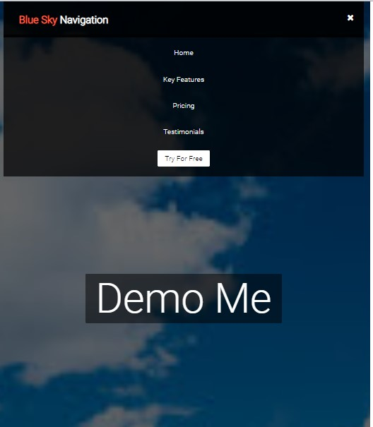
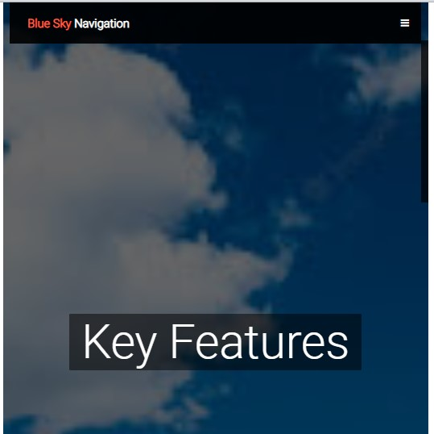
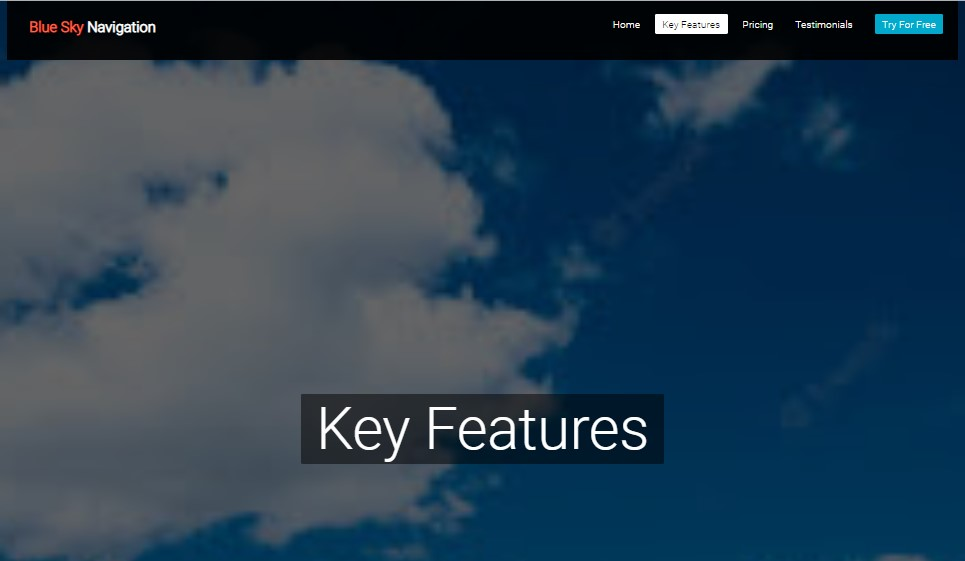

# Navbar-with-Routing
Responsive navigation bar with routing using bootstrap

  

  

  

## <ins>What it does

This is a responsive navigation bar that uses bootstrap, routing and useState along with some custom css to take the user from page to page.

## <ins>How to Run

Clone Repo into editor => Open terminal in VS Code or other editor => run "npm start" for live server

  Once installed you can click the links in the navbar to display text on the screen.  You can also adjust the screen wide and narrow to see the text and alignment of the navbar change.  In narrow mode the fa-bars make the menu appear and dissapear and there are also a few dynamic transitions just for fun.

## <ins>Future improvements

Improve the styling.  Add more content and images.

## <ins>License

MIT License

Copyright (c) 2022 Jeremy Duval

Permission is hereby granted, free of charge, to any person obtaining a copy
of this software and associated documentation files (the "Software"), to deal
in the Software without restriction, including without limitation the rights
to use, copy, modify, merge, publish, distribute, sublicense, and/or sell
copies of the Software, and to permit persons to whom the Software is
furnished to do so, subject to the following conditions:

The above copyright notice and this permission notice shall be included in all
copies or substantial portions of the Software.

THE SOFTWARE IS PROVIDED "AS IS", WITHOUT WARRANTY OF ANY KIND, EXPRESS OR
IMPLIED, INCLUDING BUT NOT LIMITED TO THE WARRANTIES OF MERCHANTABILITY,
FITNESS FOR A PARTICULAR PURPOSE AND NONINFRINGEMENT. IN NO EVENT SHALL THE
AUTHORS OR COPYRIGHT HOLDERS BE LIABLE FOR ANY CLAIM, DAMAGES OR OTHER
LIABILITY, WHETHER IN AN ACTION OF CONTRACT, TORT OR OTHERWISE, ARISING FROM,
OUT OF OR IN CONNECTION WITH THE SOFTWARE OR THE USE OR OTHER DEALINGS IN THE
SOFTWARE.
